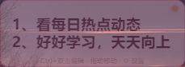
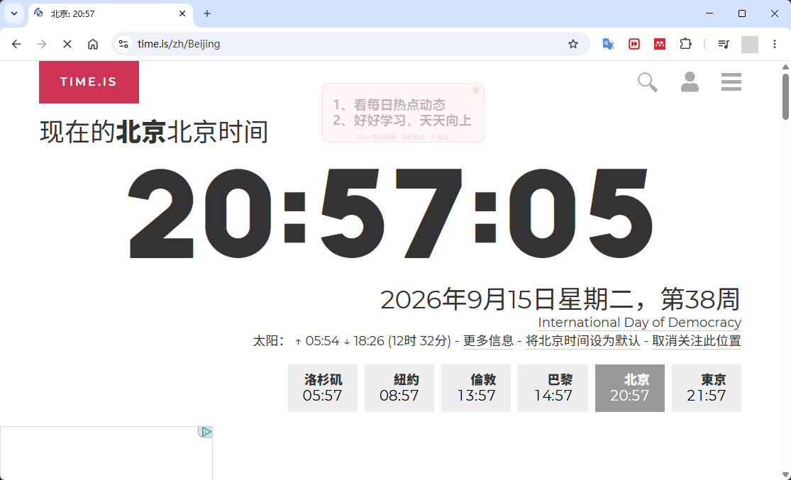
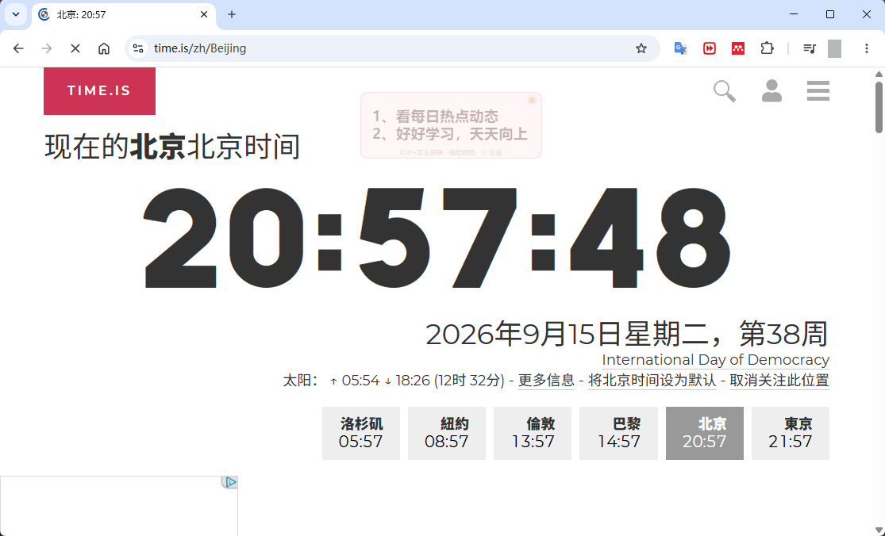

# 随时标签 OnCallLabel

> 一个常驻 Windows 桌面的悬浮便签小工具：在桌面上时完全不透明，一旦有其他窗口挡到前面，就自动降低不透明度，不遮挡你正在看的内容。


---

## ✨ 效果展示

**① 在桌面点击标签 → 100% 不透明**，右上角状态点为绿色，文字清晰醒目（下图为玫瑰粉主题）：


**② 其他窗口在前台、标签未被操作 → 自动降到 35% 不透明度**，状态点变为橙色，桌面壁纸可以透过标签看到，完全不遮挡视线：



**③ 浏览器等应用全屏工作时 → 标签半透明悬浮在最上层**，网页内容依旧清晰可读，待办事项随时可见又不影响操作：

<p>
  
  
</p>

---

## 目录

- [效果展示](#-效果展示)
- [功能特性](#功能特性)
- [运行环境要求](#运行环境要求)
- [快速上手](#快速上手)
- [操作方法](#操作方法)
- [设置说明](#设置说明)
- [数据保存在哪里](#数据保存在哪里)
- [从源码运行与打包](#从源码运行与打包)
- [项目结构](#项目结构)
- [常见问题](#常见问题)
- [二次开发指引](#二次开发指引)
- [开源协议](#开源协议)

---

## 功能特性

- **桌面悬浮、始终置顶**：标签常驻屏幕最上层，不进任务栏。
- **智能不透明度**（上方[效果展示](#-效果展示)有实景截图）
  - 前台是桌面时 → 不透明度 100%
  - 其他应用窗口在前台时 → 自动降到 35%，透过标签也能看到后面的内容
  - 点击/聚焦标签本身时恢复 100%
- **移动与缩放**
  - 直接按住标签拖动即可移动位置
  - 按住 `Ctrl` 拖动标签边缘（或四角）即可调整大小
- **编辑文本**
  - 按住 `Ctrl` 双击标签进入编辑
  - `Enter` 完成编辑，`Alt + Enter` 换行，`Esc` 取消
  - 支持多行内容
- **设置面板（独立弹窗）**：无论标签本身多小，设置窗口都能完整显示，不会被截断。
- **5 套内置主题**：深邃黑、柔光白、霓虹青、便签黄、玫瑰粉。
- **字体设置**：字号 10–72、加粗、斜体。
- **对齐方式**：左对齐 / 居中 / 右对齐。
- **开机自动启动**：一键开关，写入系统启动项，可在 Windows「任务管理器 → 启动应用」中同步管理。
- **设置持久化**：文本、主题、位置、大小、字体等全部自动保存，下次启动自动恢复。

---

## 运行环境要求

### 使用打包好的 exe

| 项目 | 要求 |
|---|---|
| 操作系统 | Windows 10（64 位）或 Windows 11 |
| 磁盘空间 | 便携版约 75 MB；解压版约 200 MB |
| 运行库 | 无需额外安装（Electron 已内置 Chromium 运行时） |

> **关于「智能应用控制 / Smart App Control」**：本软件目前使用自签名证书。如果你的 Windows 11 开启了「智能应用控制」强制模式，可能会拦截未受信任 CA 签名的 exe。可在「Windows 安全中心 → 应用和浏览器控制 → 智能应用控制」中关闭，或[从源码运行](#从源码运行与打包)。

### 从源码运行 / 开发

| 项目 | 要求 |
|---|---|
| 操作系统 | Windows 10 / 11（前台窗口检测调用了 Win32 API，仅支持 Windows） |
| Node.js | 18 LTS 或更高（在 Node 24 上验证通过） |
| npm | 随 Node.js 自带 |
| 网络 | 首次 `npm install` 需要联网下载 Electron |

---

## 快速上手

### 方式一：直接使用（推荐普通用户）

1. 到本仓库的 **Releases** 页面下载最新版本：
   - `OnCallLabel-x.x.x-portable.exe`：单文件便携版，双击即用（首次启动会自解压到临时目录）
   - `OnCallLabel-x.x.x-win.zip`：解压版，解压后双击其中的 `OnCallLabel.exe` 运行（若杀毒软件误删便携版解压出的 `ffmpeg.dll`，请改用此版本）
2. 桌面中央会出现一个写着「随时标签」的悬浮标签。
3. `Ctrl + 双击` 标签即可改成你自己的内容。

### 方式二：从源码运行（推荐开发者）

```bash
# 1. 克隆仓库
git clone https://github.com/jinhang97/OnCallLabel.git
cd OnCallLabel

# 2. 安装依赖
npm install

# 3. 启动
npm start
```

---

## 操作方法

| 操作 | 方式 |
|---|---|
| 移动标签 | 在标签上按住鼠标左键直接拖动 |
| 调整大小 | 按住 `Ctrl`，鼠标移到标签边缘/四角出现双向箭头后拖动 |
| 编辑文本 | 按住 `Ctrl` 双击标签 |
| 完成编辑 | 编辑时按 `Enter` |
| 文本内换行 | 编辑时按 `Alt + Enter` |
| 取消编辑 | 编辑时按 `Esc` |
| 打开设置 | 点击标签左上角的 **⚙ 齿轮**，或在标签上**右键** |
| 关闭设置 | 点击设置窗右上角 ×，或点击设置窗外任意区域 |

> 标签右上角的小圆点是状态指示：绿色 = 当前在桌面/已聚焦（不透明），橙色 = 有其他窗口在前台（半透明）。

---

## 设置说明

点击 ⚙ 或右键打开设置窗口：

- **主题**：在 5 套内置主题间切换，即时生效。
- **字体**
  - `A−` / `A+`：字号在 10–72 之间调整
  - `B`：加粗开关
  - `I`：斜体开关
- **对齐方式**：左对齐 / 居中 / 右对齐，对显示文本和编辑框同时生效。
- **开机自动启动**
  - 打开开关后，软件会写入当前用户的注册表启动项（`HKCU\Software\Microsoft\Windows\CurrentVersion\Run`）。
  - 也可以在 **任务管理器 → 启动应用** 标签页中看到「随时标签 OnCallLabel」并启用/禁用，两处状态会自动同步。
- **编辑文本**：关闭设置窗并让标签进入编辑状态。
- **重置位置与大小**：把标签恢复为默认尺寸（240×88）并移回屏幕中央。
- **退出**：完全关闭程序。

所有修改都会即时应用并自动保存，无需重启。

---

## 数据保存在哪里

所有设置保存在当前用户目录下的 JSON 文件中：

```
%APPDATA%\随时标签 OnCallLabel\settings.json
```

内容包括：标签文本、主题、窗口位置与大小、不透明度、字号/加粗/斜体/对齐、开机自启开关等。删除该文件即可恢复全部默认设置。

---

## 从源码运行与打包

```bash
# 安装依赖
npm install

# 开发模式运行
npm start

# 仅生成免安装目录（dist/win-unpacked/）
npm run pack

# 在已生成的 win-unpacked 基础上打便携版单文件 exe
npm run dist:portable

# 一键完成：win-unpacked + 便携版 exe
npm run dist
```

打包产物输出在 `dist/` 目录：

- `dist/win-unpacked/`：免安装绿色目录，直接运行 `OnCallLabel.exe`
- `dist/OnCallLabel-x.x.x-portable.exe`：单文件便携版

> 国内网络下若 Electron 下载慢，可设置镜像：
> ```powershell
> $env:ELECTRON_MIRROR="https://npmmirror.com/mirrors/electron/"
> $env:ELECTRON_BUILDER_BINARIES_MIRROR="https://npmmirror.com/mirrors/electron-builder-binaries/"
> ```
>
> 本仓库未配置代码签名证书，构建时会跳过签名（exe 不带数字签名）。

---

## 项目结构

```
OnCallLabel/
├── main.js              # 主进程：窗口创建、Win32 前台检测、不透明度、
│                        #         设置持久化、设置弹窗、开机自启、IPC
├── preload.js           # 预加载脚本：通过 contextBridge 暴露安全 IPC 接口
├── renderer/
│   ├── index.html       # 悬浮标签页面结构
│   ├── style.css        # 标签样式（主题、字体、边缘光标等）
│   ├── renderer.js      # 标签交互：拖动、缩放、编辑、快捷键
│   ├── settings.html    # 设置弹窗页面结构
│   ├── settings.css     # 设置弹窗样式
│   └── settings.js      # 设置弹窗逻辑：主题/字体/对齐/自启
├── build/
│   └── icon.png         # 应用图标
├── package.json         # 依赖与 electron-builder 打包配置
├── LICENSE              # MIT 协议
└── README.md
```

### 核心技术点

- **Electron 33**：透明、无边框、置顶的 `BrowserWindow`。
- **koffi**：加载 `user32.dll`，通过 `GetForegroundWindow` / `GetClassNameW` 判断前台是不是桌面（`Progman` / `WorkerW` / `Shell_TrayWnd`）。
- **双窗口架构**：主标签窗口 + 独立设置弹窗，设置变化通过 IPC 广播实时回写标签。
- **electron-builder**：打包为 Windows portable 单文件 exe。
- **开机自启**：`app.setLoginItemSettings()` 写入注册表 Run 项（便携版使用 `PORTABLE_EXECUTABLE_FILE` 指向原始 exe，避免临时解压目录失效）。

---

## 常见问题

**Q：双击 exe 提示「找不到 ffmpeg.dll」？**
A：多为杀毒软件在便携版自解压时误隔离了该文件。请改用 Releases 里的 `win.zip` 解压版；或将程序加入杀毒白名单后重试。

**Q：Windows 提示「智能应用控制已阻止可能不安全的应用」？**
A：本程序未购买商业代码签名证书。可关闭「智能应用控制」，或直接用 `npm start` 从源码运行（系统信任的是已签名的 Electron 运行时本身）。

**Q：标签一直半透明？**
A：只要有任意其他应用窗口处于前台，标签就会自动变为 35% 不透明度；回到桌面或点击标签即恢复。

**Q：在任务管理器禁用了开机启动，应用里开关还显示开着？**
A：不会。应用每次启动都会读取注册表真实状态并同步开关。

---

## 二次开发指引

- **改默认值**（默认文本、尺寸、字号、主题等）：编辑 `main.js` 顶部的 `defaultSettings`。
- **新增 / 修改主题**：编辑 `main.js` 中的 `builtinThemes`，每套主题包含背景、文字、边框、阴影与强调色。
- **增加设置项的最小改动**
  1. `main.js` 的 `defaultSettings` 增加字段；
  2. `renderer/settings.html` 增加控件、`renderer/settings.js` 绑定调用 `window.oncall.patchSettings({ 字段: 值 })`；
  3. 需要标签实时响应时，在 `renderer/renderer.js` 的 `onSettingsPatched` 回调里应用样式。
- **改交互快捷键**：编辑 `renderer/renderer.js` 中编辑框的 `keydown` 处理与标签上的 `dblclick` 监听。
- **新增 IPC 接口**：在 `main.js` 用 `ipcMain.handle/on` 注册，并在 `preload.js` 中通过 `contextBridge` 暴露，保持 `contextIsolation: true`。

---

## 开源协议

本项目基于 [MIT License](LICENSE) 开源，允许任何个人和商业用途自由使用、修改、分发，但请保留原始版权与许可声明。
